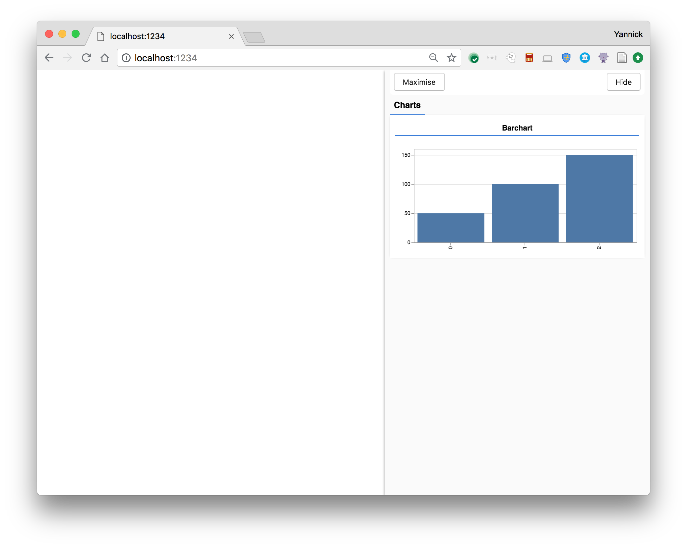

# tfjs-vis

__tfjs-vis__ is a small library for _in browser_ visualization intended for use
with TensorFlow.js.

It's main features are:

* A set of visualizations useful for visualizing model behaviour
* A set of high level functions for visualizing objects specific to TensorFlow.js
* A way to organize visualizations of model behaviour that won't interfere with your web application

The library also aims to be flexible and make it easy for you to incorporate
custom visualizations using tools of your choosing, such as d3, Chart.js or plotly.js.

## Demos

- [Visualizing Training with tfjs-vis](https://storage.googleapis.com/tfjs-vis/mnist/dist/index.html)
- [Looking inside a digit recognizer](https://storage.googleapis.com/tfjs-vis/mnist_internals/dist/index.html)

## Installation

You can install this using npm with

```
npm install @tensorflow/tfjs-vis
```

or using yarn with

```
yarn add @tensorflow/tfjs-vis
```

You can also load it via script tag using the following tag, however you need
to have TensorFlow.js also loaded on the page to work. Including both is shown
below.

```
<script src="https://cdn.jsdelivr.net/npm/@tensorflow/tfjs"> </script>
<script src="https://cdn.jsdelivr.net/npm/@tensorflow/tfjs-vis"></script>
```


## Building from source

To build the library, you need to have node.js installed. We use `yarn`
instead of `npm` but you can use either.

First install dependencies with

```
yarn
```

or

```
npm install
```

Then do a build with

```
yarn build
```

or

```
npm run build
```

This should produce a `tfjs-vis.umd.min.js` file in the `dist` folder that you can
use.

## Sample Usage

```js
const data = [
  { index: 0, value: 50 },
  { index: 1, value: 100 },
  { index: 2, value: 150 },
];

// Get a surface
const surface = tfvis.visor().surface({ name: 'Barchart', tab: 'Charts' });

// Render a barchart on that surface
tfvis.render.barchart(data, surface, {});
```

This should show something like the following



## Issues

Found a bug or have a feature request? Please file an [issue](https://github.com/tensorflow/tfjs/issues/new) on the main [TensorFlow.js repository](https://github.com/tensorflow/tfjs/issues)

## API

See https://js.tensorflow.org/api_vis/latest/ for interactive API documentation.
