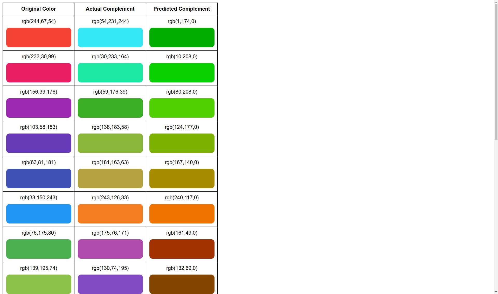

# Example: Predicting Complementary Colors

This tutorial takes the reader through coding a model that predicts the [complements of colors](https://en.wikipedia.org/wiki/Complementary_colors). The hyper-parameters of this model may not be perfectly optimized, but building the model will take us through important concepts of deeplearn.js. Indeed, adding more layers seems to yield closer predictions of complement colors. We did not spend significant time optimizing hyper-parameters - we would love a pull request towards that end.

The reader should already have read the [Introduction](../../docs/tutorials/intro.md) and possibly the [Guide for non-ML Experts](../../docs/tutorials/ml_beginners.md). This tutorial uses TypeScript, although knowledge of JavaScript suffices.

All of the code for this tutorial resides within the `demos/complementary-color-predictions` directory.

As [Edd's answer on Stack Overflow](https://stackoverflow.com/a/37657940) shows, computing the complement of a color takes quite a bit of logic. Let's see how well a small [feed-forward neural network](https://en.wikipedia.org/wiki/Feedforward_neural_network) can learn that logic.

## Creating Input Examples

We first generate training data: We generate random colors in RGB space,

```ts
const rawInputs = new Array(exampleCount);
for (let i = 0; i < exampleCount; i++) {
  rawInputs[i] = [
    this.generateRandomChannelValue(), this.generateRandomChannelValue(),
    this.generateRandomChannelValue()
  ];
}
```

and then compute their complements via Edd's helpful solution.

```ts
/**
 * This implementation of computing the complementary color came from an
 * answer by Edd https://stackoverflow.com/a/37657940
 */
computeComplementaryColor(rgbColor: number[]): number[] {
  let r = rgbColor[0];
  let g = rgbColor[1];
  let b = rgbColor[2];

  // Convert RGB to HSL
  // Adapted from answer by 0x000f http://stackoverflow.com/a/34946092/4939630
  r /= 255.0;
  g /= 255.0;
  b /= 255.0;
  const max = Math.max(r, g, b);
  const min = Math.min(r, g, b);
  let h = (max + min) / 2.0;
  let s = h;
  const l = h;

  if (max === min) {
    h = s = 0;  // achromatic
  } else {
    const d = max - min;
    s = (l > 0.5 ? d / (2.0 - max - min) : d / (max + min));

    if (max === r && g >= b) {
      h = 1.0472 * (g - b) / d;
    } else if (max === r && g < b) {
      h = 1.0472 * (g - b) / d + 6.2832;
    } else if (max === g) {
      h = 1.0472 * (b - r) / d + 2.0944;
    } else if (max === b) {
      h = 1.0472 * (r - g) / d + 4.1888;
    }
  }

  h = h / 6.2832 * 360.0 + 0;

  // Shift hue to opposite side of wheel and convert to [0-1] value
  h += 180;
  if (h > 360) {
    h -= 360;
  }
  h /= 360;

  // Convert h s and l values into r g and b values
  // Adapted from answer by Mohsen http://stackoverflow.com/a/9493060/4939630
  if (s === 0) {
    r = g = b = l;  // achromatic
  } else {
    const hue2rgb = (p: number, q: number, t: number) => {
      if (t < 0) t += 1;
      if (t > 1) t -= 1;
      if (t < 1 / 6) return p + (q - p) * 6 * t;
      if (t < 1 / 2) return q;
      if (t < 2 / 3) return p + (q - p) * (2 / 3 - t) * 6;
      return p;
    };

    const q = l < 0.5 ? l * (1 + s) : l + s - l * s;
    const p = 2 * l - q;

    r = hue2rgb(p, q, h + 1 / 3);
    g = hue2rgb(p, q, h);
    b = hue2rgb(p, q, h - 1 / 3);
  }

  return [r, g, b].map(v => Math.round(v * 255));
}
```

We normalize inputs by dividing each color channel by 255. [Normalization can often help the training process](https://stackoverflow.com/q/4674623/1276460).

```ts
normalizeColor(rgbColor: number[]): number[] {
  return rgbColor.map(v => v / 255);
}
```

We store each input (now a list of 3 values between 0 and 1) within an `Array1D`, a deeplearn.js construct that places data on the GPU. `inputArray` and `targetArray` are both lists of `Array1D`s.

```ts
const inputArray: Array1D[] =
    rawInputs.map(c => Array1D.new(this.normalizeColor(c)));
const targetArray: Array1D[] = rawInputs.map(
    c => Array1D.new(
        this.normalizeColor(this.computeComplementaryColor(c))));
```

Afterwards, we build a `ShuffledInputProvider`, which shuffles our input data (which comprise of those 2 lists). While shuffling the input data, the `ShuffledInputProvider` maintains the relationship between inputs and target (so elements in both arrays get shuffled to the same indices).

```ts
const shuffledInputProviderBuilder =
    new InCPUMemoryShuffledInputProviderBuilder(
        [inputArray, targetArray]);
const [inputProvider, targetProvider] =
    shuffledInputProviderBuilder.getInputProviders();
```

Using the providers, we create feed entries for passing data to the model.

```ts
this.feedEntries = [
  {tensor: this.inputTensor, data: inputProvider},
  {tensor: this.targetTensor, data: targetProvider}
];
```

## Setting Up the Graph

This part is exciting because we construct the model. Like TensorFlow, deeplearn.js is a graph-based API: We first design a model before using sessions to run it.

We create a `Graph` object and 2 tensors: 1 for the input color and 1 for the target color. The target color is only populated during training (and not inference) - during inference, we are only given an input color and must predict a target.

Per above, the tensors are used within the feed entries to pass data to the model.

```ts
const graph = new Graph();

// This tensor contains the input. In this case, it is a scalar.
this.inputTensor = graph.placeholder('input RGB value', [3]);

// This tensor contains the target.
this.targetTensor = graph.placeholder('output RGB value', [3]);
```

We code a function that makes a fully connected layer using `graph.layers.dense`.

```ts
private createFullyConnectedLayer(
    graph: Graph, inputLayer: Tensor, layerIndex: number,
    sizeOfThisLayer: number, includeRelu = true, includeBias = true) {
  return graph.layers.dense(
      'fully_connected_' + layerIndex, inputLayer, sizeOfThisLayer,
      includeRelu ? (x) => graph.relu(x) : undefined, includeBias);
}
```

Using that function, we create 3 fully connected layers with 64, 32, and 16 nodes.

```ts
// Create 3 fully connected layers, each with half the number of nodes of
// the previous layer. The first one has 16 nodes.
let fullyConnectedLayer =
    this.createFullyConnectedLayer(graph, this.inputTensor, 0, 64);

// Create fully connected layer 1, which has 8 nodes.
fullyConnectedLayer =
    this.createFullyConnectedLayer(graph, fullyConnectedLayer, 1, 32);

// Create fully connected layer 2, which has 4 nodes.
fullyConnectedLayer =
    this.createFullyConnectedLayer(graph, fullyConnectedLayer, 2, 16);
```

We create a layer that outputs the normalized predicted complement color. It has 3 outputs, 1 for each channel.

```ts
this.predictionTensor =
    this.createFullyConnectedLayer(graph, fullyConnectedLayer, 3, 3);
```

We also add a cost tensor that specifies the loss function (mean squared).

```ts
this.costTensor =
    graph.meanSquaredCost(this.targetTensor, this.predictionTensor);
```

Finally, we create a session for running training and inference.

```ts
this.session = new Session(graph, this.math);
```

## Train and Predict

To train the model, we construct an optimizer (with an initial learning rate of 0.042),

```ts
this.optimizer = new SGDOptimizer(this.initialLearningRate);
```

and then write a function that trains on a batch of colors. Note that we wrap the call for the session to train within a `math.scope` callback. Using `math.scope` is obligatory here (and in other parts of the code) because it allows deeplearn.js to reap resources (such as data on the GPU) once they are no longer needed.

Also note that the `train1Batch` method accepts a `shouldFetchCost` parameter. This allows an outer loop (that calls `train1Batch`) to fetch the value of the cost at only certain steps. Fetching the value of the cost from the GPU incurs latency because it involves transfer of data from the GPU, so we only do so now and then.

```ts
train1Batch(shouldFetchCost: boolean): number {
  // Every 42 steps, lower the learning rate by 15%.
  const learningRate =
      this.initialLearningRate * Math.pow(0.85, Math.floor(step / 42));
  this.optimizer.setLearningRate(learningRate);

  // Train 1 batch.
  let costValue = -1;
  this.math.scope(() => {
    const cost = this.session.train(
        this.costTensor, this.feedEntries, this.batchSize, this.optimizer,
        shouldFetchCost ? CostReduction.MEAN : CostReduction.NONE);

    if (!shouldFetchCost) {
      // We only train. We do not compute the cost.
      return;
    }

    // Compute the cost (by calling get), which requires transferring data
    // from the GPU.
    costValue = cost.get();
  });
  return costValue;
}
```

In addition, we write a method for performing inference on any given color. We create a `FeedEntry` called `mapping` to pass the input color to the model.

```ts
predict(rgbColor: number[]): number[] {
  let complementColor: number[] = [];
  this.math.scope((keep, track) => {
    const mapping = [{
      tensor: this.inputTensor,
      data: Array1D.new(this.normalizeColor(rgbColor)),
    }];
    const evalOutput = this.session.eval(this.predictionTensor, mapping);
    const values = evalOutput.dataSync();
    const colors = this.denormalizeColor(Array.prototype.slice.call(values));

    // Make sure the values are within range.
    complementColor = colors.map(
        v => Math.round(Math.max(Math.min(v, 255), 0)));
  });
  return complementColor;
}
```

## Updating the UI

The rest of the logic within the `.ts` file mostly manages the UI. Calling the `trainAndMaybeRender` method starts a loop that performs training and renders in a way that is sync-ed with the browser viewport refresh rate (thanks to `requestAnimationFrame`). We stop training after 4242 steps. We also log the loss in the console.

Based on a few sample colors, it seems like our model of `64 + 32 + 16 = 112` middle-layer nodes fairs alright.


### Initialization of Weights Matters

Now and then, a channel of the predicted complementary color may stay at 0 throughout training. For instance, in the screenshot below, the blue channel is stuck at 0.



This behavior unfortunately stems from how weight initialization matters toward whether training happens. Sometimes, a channel stuck at 0 may resolve over time. Other times, a page refresh may be necessary.

### End

Hopefully, perusing the code (within this same directory) and the comments within it offers a simple example of how deeplearn.js works. Keep us posted on interesting projects you pursue.
