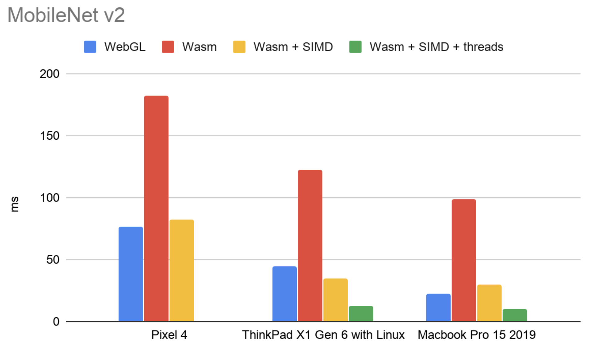
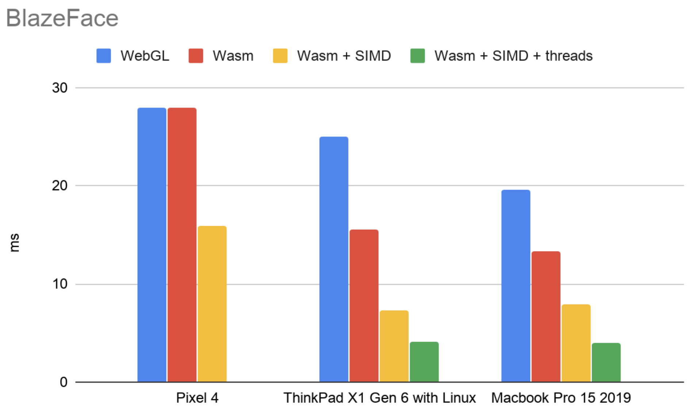

# Usage

This package adds a WebAssembly backend to TensorFlow.js. It currently supports
the following models from our
[models](https://github.com/tensorflow/tfjs-models) repo:
- BlazeFace
- BodyPix
- CocoSSD
- Face landmarks detection
- HandPose
- KNN classifier
- MobileNet
- PoseDetection
- Q&A
- AutoML Image classification
- AutoML Object detection

## Importing the backend

### Via NPM

```js
// Import @tensorflow/tfjs or @tensorflow/tfjs-core
import * as tf from '@tensorflow/tfjs';
// Adds the WASM backend to the global backend registry.
import '@tensorflow/tfjs-backend-wasm';
// Set the backend to WASM and wait for the module to be ready.
tf.setBackend('wasm').then(() => main());
```

### Via a script tag

```html
<!-- Import @tensorflow/tfjs or @tensorflow/tfjs-core -->
<script src="https://cdn.jsdelivr.net/npm/@tensorflow/tfjs"></script>

<!-- Adds the WASM backend to the global backend registry -->
<script src="https://cdn.jsdelivr.net/npm/@tensorflow/tfjs-backend-wasm/dist/tf-backend-wasm.js"></script>
<script>
tf.setBackend('wasm').then(() => main());
</script>
```

## Setting up cross-origin isolation

Starting from Chrome 92 (to be released around July 2021), **cross-origin
isolation** needs to be set up in your site in order to take advantage of
the multi-threading support in WASM backend. Without this, the backend
will fallback to the WASM binary with SIMD-only support (or the vanila version
if SIMD is not enabled). Without multi-threading support, certain models might
not achieve the best performance.

Here are the high-level steps to set up the cross-origin isolation. You can
learn more about this topic [here](https://web.dev/coop-coep/).

1. Send the following two HTTP headers when your main document (e.g.index.html)
   that uses the WASM backend is served. You may need to configure or ask your
   web host provider to enable these headers.

   - `Cross-Origin-Opener-Policy: same-origin`
   - `Cross-Origin-Embedder-Policy: require-corp`

1. If you are loading the WASM backend from `jsdelivr` through the script tag,
   you are good to go. No more steps are needed.

   If you are loading the WASM backend from your own or other third-party
   servers, you need to make sure the script is served with either CORS or CORP
   header.

   - CORS header: `Access-Control-Allow-Origin: *`. In addition, you will also
     need to add the "crossorigin" attribute to your script tags.

   - CORP header:

     - If the resource is loaded from the *same origin* as your main site
       (e.g. main site: mysite.com/, script: mysite.com/script.js), set:

       `Cross-Origin-Resource-Policy: same-origin`
     - If the resource is loaded from the *same site but cross origin*
       (e.g. main site: mysite.com/, script: static.mysite.com:8080/script.js),
       set:


       `Cross-Origin-Resource-Policy: same-site`
     - If the resource is loaded from the *cross origin(s)*
       (e.g. main site: mysite.com/, script: mystatic.com/script.js), set:

       `Cross-Origin-Resource-Policy: cross-origin`

If the steps above are correctly done, you can check the Network tab from the
console and make sure the
<code>tfjs-backend-wasm-<b>threaded-simd</b>.wasm</code> WASM binary is loaded.

## Running MobileNet

```js
async function main() {
  let img = tf.browser.fromPixels(document.getElementById('img'))
      .resizeBilinear([224, 224])
      .expandDims(0)
      .toFloat();

  let model = await tf.loadGraphModel(
    'https://tfhub.dev/google/imagenet/mobilenet_v2_100_224/classification/2',
    {fromTFHub: true});
  const y = model.predict(img);

  y.print();
}
main();
```

Our WASM backend builds on top of the
[XNNPACK library](https://github.com/google/XNNPACK) which provides
high-efficiency floating-point neural network inference operators.

## Using bundlers

The shipped library on NPM consists of 2 files:
- the main js file (bundled js for browsers)
- the WebAssembly binary in `dist/tfjs-backend-wasm.wasm`

There is a [proposal](https://github.com/WebAssembly/esm-integration) to add
WASM support for ES6 modules. In the meantime, we have to manually read the wasm
file. When the WASM backend is initialized, we make a `fetch`/`readFile`
for `tfjs-backend-wasm.wasm` relative from the main js file. This means that
bundlers such as Parcel and WebPack need to be able to serve the `.wasm` file in
production. See [starter/parcel](./starter/parcel/) and
[starter/webpack](./starter/webpack/) for how to setup your favorite bundler.

If you are serving the `.wasm` files from a different directory, call
`setWasmPaths` with the location of that directory before you initialize the
backend:

```ts
import {setWasmPaths} from '@tensorflow/tfjs-backend-wasm';
// setWasmPaths accepts a `prefixOrFileMap` argument which can be either a
// string or an object. If passing in a string, this indicates the path to
// the directory where your WASM binaries are located.
setWasmPaths('www.yourdomain.com/'); // or tf.wasm.setWasmPaths when using <script> tags.
tf.setBackend('wasm').then(() => {...});
```

Note that if you call `setWasmPaths` with a string, it will be used to load
each binary (SIMD-enabled, threading-enabled, etc.) Alternatively you can specify
overrides for individual WASM binaries via a file map object. This is also helpful
in case your binaries have been renamed.

For example:

```ts
import {setWasmPaths} from '@tensorflow/tfjs-backend-wasm';
setWasmPaths({
  'tfjs-backend-wasm.wasm': 'www.yourdomain.com/renamed.wasm',
  'tfjs-backend-wasm-simd.wasm': 'www.yourdomain.com/renamed-simd.wasm',
  'tfjs-backend-wasm-threaded-simd.wasm': 'www.yourdomain.com/renamed-threaded-simd.wasm'
  });
tf.setBackend('wasm').then(() => {...});
```

If you are using a platform that does not support fetch directly, please set the
optional `usePlatformFetch` argument to `true`:

```ts
import {setWasmPath} from '@tensorflow/tfjs-backend-wasm';
const usePlatformFetch = true;
setWasmPaths(yourCustomPathPrefix, usePlatformFetch);
tf.setBackend('wasm').then(() => {...});
```

## JS Minification

If your bundler is capable of minifying JS code, please turn off the option
that transforms ```typeof foo == "undefined"``` into ```foo === void 0```. For
example, in [terser](https://github.com/terser/terser), the option is called
"typeofs" (located under the
[Compress options](https://github.com/terser/terser#compress-options) section).
Without this feature turned off, the minified code will throw "_scriptDir is not
defined" error from web workers when running in browsers with
SIMD+multi-threading support.

## Use with Angular

If you see the `Cannot find name 'EmscriptenModule'` error when building your
Angular app, make sure to add `"@types/emscripten"` to the
`compilerOptions.types` field in your `tsconfig.app.json` (or `tsconfig.json`):

```
{
  ...
  "compilerOptions": {
    "types": [
      "@types/emscripten"
    ]
  },
  ...
}
```

By default, the generated Angular app sets this field to an empty array
which will prevent the Angular compiler from automatically adding
"global types" (such as `EmscriptenModule`) defined in `d.ts` files to your app.


## Benchmarks

The benchmarks below show inference times (ms) for two different edge-friendly
models: MobileNet V2 (a medium-sized model) and Face Detector (a lite model).
All the benchmarks were run in Chrome 79.0 using
[this benchmark page](../tfjs-core/benchmarks/index.html) across our three
backends: Plain JS (CPU), WebGL and WASM. Inference times are averaged
across 200 runs.

### MobileNet V2

MobileNet is a medium-sized model with 3.48M params and ~300M multiply-adds.
For this model, the WASM backend is between ~3X-11.5X faster than the plain
JS backend, and ~5.3-7.7X slower than the WebGL backend.



| MobileNet inference (ms) | WASM  | WebGL | Plain JS | WASM + SIMD | WASM + SIMD + threads
|--------------------------|-------|-------|----------|-------------|----------------------
| iPhone X                 | 147.1 | 20.3  | 941.3    | N/A         | N/A                 |
| iPhone XS                | 140   | 18.1  | 426.4    | N/A         | N/A                 |
| Pixel 4                  | 182   | 76.4  | 1628     | 82          | N/A                 |
| ThinkPad X1 Gen6 w/Linux | 122.7 | 44.8  | 1489.4   | 34.6        | 12.4                |
| Desktop Windows          | 123.1 | 41.6  | 1117     | 37.2        | N/A                 |
| Macbook Pro 15 2019      | 98.4  | 19.6  | 893.5    | 30.2        | 10.3                |
| Node v.14 on Macbook Pro | 290   | N/A   | 1404.3   | 64.2        | N/A                 |


### Face Detector

Face detector is a lite model with 0.1M params and ~20M multiply-adds. For this model,
the WASM backend is between ~8.2-19.8X faster than the plain JS backend and
comparable to the WebGL backend (up to ~1.7X faster, or 2X slower, depending on
the device).



| Face Detector inference (ms) | WASM | WebGL | Plain JS | WASM + SIMD | WASM + SIMD + threads
|------------------------------|------|-------|----------|-------------|----------------------
| iPhone X                     | 22.4 | 13.5  | 318      | N/A         | N/A                 |
| iPhone XS                    | 21.4 | 10.5  | 176.9    | N/A         | N/A                 |
| Pixel 4                      | 28   | 28    | 368      | 15.9        | N/A                 |
| Desktop Linux                | 12.6 | 12.7  | 249.5    | 8.0         | 6.2                 |
| Desktop Windows              | 16.2 | 7.1   | 270.9    | 7.5         | N/A                 |
| Macbook Pro 15 2019          | 13.6 | 22.7  | 209.1    | 7.9         | 4.0                 |

# FAQ

### When should I use the WASM backend?
You should always try to use the WASM backend over the plain JS backend since
it is strictly faster on all devices, across all model sizes.
Compared to the WebGL backend, the WASM backend has better numerical stability,
and wider device support. Performance-wise, our benchmarks show that:
- For medium-sized models (~100-500M multiply-adds), the WASM backend is several
times slower than the WebGL backend.
- For lite models (~20-60M multiply-adds), the WASM backend has comparable
performance to the WebGL backend
(see the [Face Detector model](#face-detector) above).

We are committed to supporting the WASM backend and will continue to improve
performance. We plan to follow the WebAssembly standard closely and benefit from
its upcoming features such as multi-threading.

### How many ops have you implemented?
See [`register_all_kernels.ts`](https://github.com/tensorflow/tfjs/blob/master/tfjs-backend-wasm/src/register_all_kernels.ts)
for an up-to-date list of supported ops. We love contributions. See the
[contributing](https://github.com/tensorflow/tfjs/blob/master/CONTRIBUTING.md#adding-functionality)
document for more info.

### Do you support training?
Maybe. There are still a decent number of ops that we are missing in WASM that
are needed for gradient computation. At this point we are focused on making
inference as fast as possible.

### Do you work in node?
Yes. If you run into issues, please let us know.

### Do you support SIMD and multi-threading?
Yes. We take advantage of SIMD and multi-threading wherever they are supported by testing the capabilities of your runtime and loading the appropriate WASM binary. If you intend to serve the WASM binaries from a custom location (via `setWasmPaths`), please note that the SIMD-enabled and threading-enabled binaries are separate from the regular binary.

### How do I give feedback?
We'd love your feedback as we develop this backend! Please file an issue
[here](https://github.com/tensorflow/tfjs/issues/new).

# Development

## Emscripten installation
The Emscripten installation necessary to build the WASM backend is managed automatically by the [Bazel Emscripten Toolchain](https://github.com/emscripten-core/emsdk/tree/master/bazel).

## Building

```sh
yarn build
```

## Testing

```sh
yarn test
```

## Deployment
```sh
./scripts/build-npm.sh
npm publish
```
