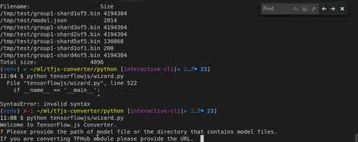

# Getting started

**TensorFlow.js converter** is an open source library to load a pretrained
TensorFlow
[SavedModel](https://www.tensorflow.org/guide/saved_model)
or [TensorFlow Hub module](https://www.tensorflow.org/hub/)
into the browser and run inference through
[TensorFlow.js](https://js.tensorflow.org).

__Note__: _Session bundle format have been deprecated.

A 2-step process to import your model:

1. A python pip package to convert a TensorFlow SavedModel or TensorFlow Hub
module to a web friendly format. If you already have a converted model, or are
using an already hosted model (e.g. MobileNet), skip this step.
2. [JavaScript API](./src/executor/graph_model.ts), for loading and running
inference.

## Step 1: Converting a [TensorFlow SavedModel](https://github.com/tensorflow/tensorflow/blob/master/tensorflow/python/saved_model/README.md), [TensorFlow Hub module](https://www.tensorflow.org/hub/), [Keras HDF5](https://keras.io/getting-started/faq/#how-can-i-save-a-keras-model), [tf.keras SavedModel](https://www.tensorflow.org/api_docs/python/tf/contrib/saved_model/save_keras_model), or [Flax/JAX model](http://github.com/google/flax) to a web-friendly format

__0. Please make sure that you run in a Docker container or a virtual environment.__

 The script pulls its own subset of TensorFlow, which might conflict with the
 existing TensorFlow/Keras installation.

__Note__: *Check that [`tf-nightly-2.0-preview`](https://pypi.org/project/tf-nightly-2.0-preview/#files) is available for your platform.*

Most of the times, this means that you have to use Python 3.6.8 in your local
environment. To force Python 3.6.8 in your local project, you can install
[`pyenv`](https://github.com/pyenv/pyenv) and proceed as follows in the target
directory:

```bash
pyenv install 3.6.8
pyenv local 3.6.8
```

Now, you can
[create and activate](https://packaging.python.org/guides/installing-using-pip-and-virtual-environments/)
a `venv` virtual environment in your current folder:

```bash
virtualenv --no-site-packages venv
. venv/bin/activate
```

__1. Install the TensorFlow.js pip package:__

Install the library with interactive CLI:
```bash
 pip install tensorflowjs[wizard]
```

__2. Run the converter script provided by the pip package:__

There are three way to trigger the model conversion, explain below:

- The conversion wizard: `tensorflowjs_wizard` ([go to section](#conversion-wizard-tensorflowjswizard))
- Regular conversion script: `tensorflowjs_converter` ([go to section](#regular-conversion-script-tensorflowjsconverter))
- Calling a converter function in Python (Flax/JAX) ([go to section](#calling-a-converter-function-in-python))

## Conversion wizard: `tensorflowjs_wizard`

To start the conversion wizard:
```bash
tensorflowjs_wizard
```

This tool will walk you through the conversion process and provide you with
details explanations for each choice you need to make. Behind the scene it calls
the converter script (`tensorflowjs_converter`) in pip package. This is the
recommended way to convert a single model.

There is also a dry run mode for the wizard, which will not perform the actual
conversion but only generate the command for `tensorflowjs_converter` command.
This generated command can be used in your own shell script.

Here is an screen capture of the wizard in action. 
```bash
tensorflowjs_wizard --dryrun
```

To convert a batch of models or integrate the conversion process into your own
script, you should use the tensorflowjs_converter script.

## Regular conversion script: `tensorflowjs_converter`

The converter expects a __TensorFlow SavedModel__, __TensorFlow Hub module__,
__TensorFlow.js JSON__ format, __Keras HDF5 model__, or __tf.keras SavedModel__
for input.

* __TensorFlow SavedModel__ example:

```bash
tensorflowjs_converter \
    --input_format=tf_saved_model \
    --output_format=tfjs_graph_model \
    --signature_name=serving_default \
    --saved_model_tags=serve \
    /mobilenet/saved_model \
    /mobilenet/web_model
```
* __TensorFlow Frozen Model__ example:

__Note:__ Frozen model is a deprecated format and support is added for backward compatibility purpose.

```bash
$ tensorflowjs_converter \
    --input_format=tf_frozen_model \
    --output_node_names='MobilenetV1/Predictions/Reshape_1' \
    /mobilenet/frozen_model.pb \
    /mobilenet/web_model
```

* __Tensorflow Hub module__ example:

```bash
tensorflowjs_converter \
    --input_format=tf_hub \
    'https://tfhub.dev/google/imagenet/mobilenet_v1_100_224/classification/1' \
    /mobilenet/web_model
```

* __Keras HDF5 model__ example:

```bash
tensorflowjs_converter \
    --input_format=keras \
    /tmp/my_keras_model.h5 \
    /tmp/my_tfjs_model
```

* __tf.keras SavedModel__ example:

```bash
tensorflowjs_converter \
    --input_format=keras_saved_model \
    /tmp/my_tf_keras_saved_model/1542211770 \
    /tmp/my_tfjs_model
```

Note that the input path used above is a subfolder that has a Unix epoch
time (1542211770) and is generated automatically by tensorflow when it
saved a tf.keras model in the SavedModel format.

### Conversion Flags

|Positional Arguments | Description |
|---|---|
|`input_path`  | Full path of the saved model directory or TensorFlow Hub module handle or path.|
|`output_path` | Path for all output artifacts.|


| Options | Description
|---|---|
|`--input_format`     | The format of input model, use `tf_saved_model` for SavedModel, `tf_hub` for TensorFlow Hub module, `tfjs_layers_model` for TensorFlow.js JSON format, and `keras` for Keras HDF5. |
|`--output_format`| The desired output format.  Must be `tfjs_layers_model`, `tfjs_graph_model` or `keras`. Not all pairs of input-output formats are supported.  Please file a [github issue](https://github.com/tensorflow/tfjs/issues) if your desired input-output pair is not supported.|
|<nobr>`--saved_model_tags`</nobr> | Only applicable to SavedModel conversion. Tags of the MetaGraphDef to load, in comma separated format. If there are no tags defined in the saved model, set it to empty string `saved_model_tags=''`. Defaults to `serve`.|
|`--signature_name`   | Only applicable to TensorFlow SavedModel and Hub module conversion, signature to load. Defaults to `serving_default` for SavedModel and `default` for Hub module. See https://www.tensorflow.org/hub/common_signatures/.|
|`--strip_debug_ops`   | Strips out TensorFlow debug operations `Print`, `Assert`, `CheckNumerics`. Defaults to `True`.|
|`--quantization_bytes`  | (Deprecated) How many bytes to optionally quantize/compress the weights to. Valid values are 1 and 2. which will quantize int32 and float32 to 1 or 2 bytes respectively. The default (unquantized) size is 4 bytes.|
|`--quantize_float16`  | Comma separated list of node names to apply float16 quantization. You can also use wildcard symbol (\*) to apply quantization to multiple nodes (e.g., conv/\*/weights). When the flag is provided without any nodes the default behavior will match all nodes. |
|`--quantize_uint8`  | Comma separated list of node names to apply 1-byte affine quantization. You can also use wildcard symbol (\*) to apply quantization to multiple nodes (e.g., conv/\*/weights). When the flag is provided without any nodes the default behavior will match all nodes. |
|`--quantize_uint16`  | Comma separated list of node names to apply 2-byte affine quantization. You can also use wildcard symbol (\*) to apply quantization to multiple nodes (e.g., conv/\*/weights). When the flag is provided without any nodes the default behavior will match all nodes. |
|`--weight_shard_size_bytes` | Shard size (in bytes) of the weight files. Only supported when `output_format` is `tfjs_layers_model` or `tfjs_graph_model`. Default size is 4 MB (4194304 bytes).|
|<nobr>`--output_node_names`</nobr>| Only applicable to Frozen Model. The names of the output nodes, separated by commas.|
|<nobr>`--control_flow_v2`</nobr>| Only applicable to TF 2.x Saved Model. This flag improve performance on models with control flow ops, default to False.|
|<nobr>`--metadata`</nobr>| Comma separated list of metadata json file paths, indexed by name. Prefer absolute path. Example: 'metadata1:/metadata1.json,metadata2:/metadata2.json'.|
|<nobr>`--use_structured_outputs_names`</nobr>| Changes output of graph model to match the structured_outputs format instead of list format. Defaults to `False`.|

__Note: If you want to convert TensorFlow session bundle, you can install older versions of the tensorflowjs pip package, i.e. `pip install tensorflowjs==0.8.6`.__

### Format Conversion Support Tables

Note: Unless stated otherwise, we can infer the value of `--output_format` from the
value of `--input_format`. So the `--output_format` flag can be omitted in
most cases.

#### Python-to-JavaScript

| `--input_format` | `--output_format` | Description |
|---|---|---|
| `keras` | `tfjs_layers_model` | Convert a keras or tf.keras HDF5 model file to TensorFlow.js Layers model format. Use [`tf.loadLayersModel()`](https://js.tensorflow.org/api/latest/#loadLayersModel) to load the model in JavaScript. The loaded model supports the full inference and training (e.g., transfer learning) features of the original keras or tf.keras model. |
| `keras` | `tfjs_graph_model` | Convert a keras or tf.keras HDF5 model file to TensorFlow.js Graph model format. Use [`tf.loadGraphModel()`](https://js.tensorflow.org/api/latest/#loadGraphModel) to load the converted model in JavaScript. The loaded model supports only inference, but the speed of inference is generally faster than that of a tfjs_layers_model (see above row) thanks to the graph optimization performed by TensorFlow. Another limitation of this conversion route is that it does not support some layer types (e.g., recurrent layers such as LSTM) yet. |
| `keras_saved_model` | `tfjs_layers_model` | Convert a tf.keras SavedModel model file (from [`tf.contrib.saved_model.save_keras_model`](https://www.tensorflow.org/api_docs/python/tf/contrib/saved_model/save_keras_model)) to TensorFlow.js Layers model format. Use [`tf.loadLayersModel()`](https://js.tensorflow.org/api/latest/#loadLayersModel) to load the model in JavaScript. |
| `tf_hub` | `tfjs_graph_model` | Convert a [TF-Hub](https://www.tensorflow.org/hub) model file to TensorFlow.js graph model format. Use [`tf.loadGraphModel()`](https://js.tensorflow.org/api/latest/#loadGraphModel) to load the converted model in JavaScript. |
| `tf_saved_model` | `tfjs_graph_model` | Convert a [TensorFlow SavedModel](https://www.tensorflow.org/guide/saved_model#build_and_load_a_savedmodel) to TensorFlow.js graph model format. Use [`tf.loadGraphModel()`](https://js.tensorflow.org/api/latest/#loadGraphModel) to load the converted model in JavaScript. |
| `tf_frozen_model` | `tfjs_graph_model` | Convert a [Frozen Model](https://www.tensorflow.org/mobile/prepare_models#how_do_you_get_a_model_you_can_use_on_mobile) to TensorFlow.js graph model format. Use [`tf.loadGraphModel()`](https://js.tensorflow.org/api/latest/#loadGraphModel) to load the converted model in JavaScript. |

#### JavaScript-to-Python

| `--input_format` | `--output_format` | Description |
|---|---|---|
| `tfjs_layers_model` | `keras` | Convert a TensorFlow.js Layers model (JSON + binary weight file(s)) to a Keras HDF5 model file. Use [`keras.model.load_model()`](https://keras.io/getting-started/faq/#savingloading-whole-models-architecture-weights-optimizer-state) or [`tf.keras.models.load_model()`](https://www.tensorflow.org/api_docs/python/tf/keras/models/load_model) to load the converted model in Python. |
| `tfjs_layers_model` | `keras_saved_model` | Convert a TensorFlow.js Layers model (JSON + binary weight file(s)) to the tf.keras SavedModel format. This format is useful for subsequent uses such as [TensorFlow Serving](https://www.tensorflow.org/tfx/serving/serving_basic) and [conversion to TFLite](https://www.tensorflow.org/lite/convert). |

#### JavaScript-to-JavaScript

##### Converting tfjs_layers_model to tfjs_layers_model with weight sharding and quantization

The tfjs_layers_model-to-tfjs_layer_model conversion option serves the following
purposes:

1. It allows you to shard the binary weight file into multiple small shards
   to facilitate browser caching. This step is necessary for models with
   large-sized weights saved from TensorFlow.js (either browser or Node.js),
   because TensorFlow.js puts all weights in a single weight file
   ('group1-shard1of1.bin'). To shard the weight file, do

   ```sh
   tensorflowjs_converter \
       --input_format tfjs_layers_model \
       --output_format tfjs_layers_model \
       original_model/model.json \
       sharded_model/
   ```

    The command above creates shards of size 4 MB (4194304 bytes) by default.
    Alternative shard sizes can be specified using the
    `--weight_shard_size_bytes` flag.

2. It allows you to reduce the on-the-wire size of the weights through
   16- or 8-bit quantization. For example:

   ```sh
   tensorflowjs_converter \
      --input_format tfjs_layers_model \
      --output_format tfjs_layers_model \
      --quantize_uint16 \
      original_model/model.json
      quantized_model/
   ```

##### Converting tfjs_layers_model to tfjs_graph_model

Converting a `tfjs_layers_model` to a `tfjs_graph_model` usually leads to
faster inference speed in the browser and Node.js, thanks to the graph
optimization that goes into generating the tfjs_graph_models. For more details,
see the following document on TensorFlow's Grappler:
["TensorFlow Graph Optimizations" by R. Larsen an T. Shpeisman](https://ai.google/research/pubs/pub48051).

There are two caveats:

1. The model that results from this conversion does not support further
   training.
2. Certain layer types (e.g., recurrent layers such as LSTM) are not supported
   yet.

See example command below:

```sh
 tensorflowjs_converter \
    --input_format tfjs_layers_model \
    --output_format tfjs_graph_model \
    my_layers_model/model.json
    my_graph_model/
```

tfjs_layers_model-to-tfjs_graph_model also support weight quantization.

### Web-friendly format

The conversion script above produces 2 types of files:

* `model.json` (the dataflow graph and weight manifest file)
* `group1-shard\*of\*` (collection of binary weight files)

For example, here is the MobileNet model converted and served in
following location:

```html
  https://storage.cloud.google.com/tfjs-models/savedmodel/mobilenet_v1_1.0_224/model.json
  https://storage.cloud.google.com/tfjs-models/savedmodel/mobilenet_v1_1.0_224/group1-shard1of5
  ...
  https://storage.cloud.google.com/tfjs-models/savedmodel/mobilenet_v1_1.0_224/group1-shard5of5
```

## Calling a Converter Function in Python (Flax/JAX)

You can also convert your model to web format in Python by calling one of the
conversion functions. This is currently the only way to convert a Flax or JAX
model, since no standard serialization format exists to store a Module (only the
checkpoints).

Here we provide an example of how to convert a Flax function using the
conversion function `tfjs.jax_conversion.convert_jax()`.

```py
import numpy as np
from flax import linen as nn
from jax import random
import jax.numpy as jnp
from tensorflowjs.converters import jax_conversion

module = nn.Dense(features=4)
inputs = jnp.ones((3, 4))
params = module.init(random.PRNKey(0), inputs)['params']

jax_conversion.convert_jax(
  apply_fn=module.apply,
  params=params,
  input_signatures=[((3, 4), np.float32)],
  model_dir=tfjs_model_dir)
```

Note that when using dynamic shapes, an additional argument `polymorphic_shapes`
should be provided specifying values for the dynamic ("polymorphic")
dimensions). So in order to convert the same model as before, but now with a
dynamic first dimension, one should call `convert_jax` as follows:

```py
jax_conversion.convert_jax(
  apply_fn=module.apply,
  params=params,
  input_signatures=[((None, 4), np.float32)],
  polymorphic_shapes=["(b, 4)"],
  model_dir=tfjs_model_dir)
```

See
[here](https://github.com/google/jax/tree/main/jax/experimental/jax2tf#shape-polymorphic-conversion)
for more details on the exact syntax for this argument.

When converting JAX models, you can also pass any [options that
`convert_tf_saved_model`
uses](https://github.com/tensorflow/tfjs/blob/master/tfjs-converter/python/tensorflowjs/converters/tf_saved_model_conversion_v2.py#L951-L974).
For example, to quantize a model's weights, pass the `quantization_dtype_map`
option listing the weights that should be quantized.

```py
jax_conversion.convert_jax(
  apply_fn=module.apply,
  params=params,
  input_signatures=[((3, 4), np.float32)],
  model_dir=tfjs_model_dir,
  quantization_dtype_map={'float16': '*'})
```

## Step 2: Loading and running in the browser

If the original model was a `SavedModel`, use
[`tf.loadGraphModel()`](https://js.tensorflow.org/api/latest/#loadGraphModel).
If it was Keras, use
[`tf.loadLayersModel()`](https://js.tensorflow.org/api/latest/#loadLayersModel):

```typescript
import * as tf from '@tensorflow/tfjs';

const MODEL_URL = 'https://.../mobilenet/model.json';

// For Keras use tf.loadLayersModel().
const model = await tf.loadGraphModel(MODEL_URL);
const cat = document.getElementById('cat');
model.predict(tf.browser.fromPixels(cat));
```

See our API docs for the
[`predict()`](https://js.tensorflow.org/api/latest/#tf.GraphModel.predict)
method. To see what other methods exist on a `Model`, see
[`tf.LayersModel`](https://js.tensorflow.org/api/latest/#class:LayersModel)
and [`tf.GraphModel`](https://js.tensorflow.org/api/latest/#class:GraphModel).
Also check out our working [MobileNet demo](./demo/mobilenet/README.md).

If your server requests credentials for accessing the model files, you can
provide the optional RequestOption param.

```typescript
const model = await loadGraphModel(MODEL_URL,
    {credentials: 'include'});
```

Please see
[fetch() documentation](https://developer.mozilla.org/en-US/docs/Web/API/WindowOrWorkerGlobalScope/fetch)
for details.

### Native File System

TensorFlow.js can be used from Node.js. See the
[tfjs-node project](https://github.com/tensorflow/tfjs-node) for more details.
Unlike web browsers, Node.js can access the local file system directly.
Therefore, you can load the same frozen model from local file system into
a Node.js program running TensorFlow.js. This is done by calling
`loadGraphModel` with the path to the model files:

```js
// Load the tfjs-node binding
import * as tf from '@tensorflow/tfjs-node';

const MODEL_PATH = 'file:///tmp/mobilenet/model.json';
const model = await tf.loadGraphModel(MODEL_PATH);
```

You can also load the remote model files the same way as in browser, but you
might need to polyfill
the fetch() method.

## Supported operations

Currently TensorFlow.js only supports a limited set of TensorFlow Ops. See the
[full list](./docs/supported_ops.md).
If your model uses unsupported ops, the `tensorflowjs_converter` script will
fail and produce a list of the unsupported ops in your model. Please file issues
to let us know what ops you need support with.

## Manual forward pass and direct weights loading

If you want to manually write the forward pass with the ops API, you can load
the weights directly as a map from weight names to tensors:

```js
import * as tf from '@tensorflow/tfjs';

const modelUrl = "https://example.org/model/model.json";

const response = await fetch(modelUrl);
this.weightManifest = (await response.json())['weightsManifest'];
const weightMap = await tf.io.loadWeights(
        this.weightManifest, "https://example.org/model");
```

`weightMap` maps a weight name to a tensor. You can use it to manually implement
the forward pass of the model:

```js
const input = tf.tensor(...);
tf.matMul(weightMap['fc1/weights'], input).add(weightMap['fc1/bias']);
```

## FAQ

__1. What TensorFlow models does the converter currently support?__

Image-based models (MobileNet, SqueezeNet, add more if you tested) are the most
supported. Models with control flow ops (e.g. RNNs) are also supported.
The tensorflowjs_converter script will validate the model you have and show a
list of unsupported ops in your model. See [this list](./docs/supported_ops.md)
for which ops are currently supported.

__2. Will model with large weights work?__

While the browser supports loading 100-500MB models, the page load time,
the inference time and the user experience would not be great. We recommend
using models that are designed for edge devices (e.g. phones). These models are
usually smaller than 30MB.

__3. Will the model and weight files be cached in the browser?__

Yes, we are splitting the weights into files of 4MB chunks, which enable the
browser to cache them automatically. If the model architecture is less than 4MB
(most models are), it will also be cached.

__4. Can I quantize the weights over the wire?__

Yes, you can use the --quantize_{float16, uint8, uint16} flags to compress
weights with 1 byte integer quantization (`uint8`) or 2 byte integer
(`uint16`)/float (`float16`) quantization.
Quantizing to float16 may provide better accuracy over
2 byte affine integer scaling (`uint16`). 1-byte affine quantization,
i.e., `uint8` provides a 4x size reduction at the cost of accuracy.
For example, we can quantize our MobileNet model using float16 quantization:

```
tensorflowjs_converter
    --quantize_float16 \
    --input_format=tf_hub \
    'https://tfhub.dev/google/imagenet/mobilenet_v1_100_224/classification/1' \
    /mobilenet/web_model
```

You can also quantize specific weights as well as weight groupings using
a wildcard replacement. For example,
```
tensorflowjs_converter
    --quantize_float16="conv/*/weights"
```
which will quantize all weights that match the pattern conv/*/weights.
This will exclude biases and any weights that don't begin with conv/.
This can be a powerful tool to reduce model size while trying to maximize
performance.

__5. Why is the predict() method for inference so much slower on the first call than the subsequent calls?__

The time of first call also includes the compilation time of WebGL shader
programs for the model. After the first call the shader programs are cached,
which makes the subsequent calls much faster. You can warm up the cache by
calling the predict method with an all zero inputs, right after the completion
of the model loading.

__6. I have a model converted with a previous version of TensorFlow.js converter (0.15.x), that is in .pb format. How do I convert it to the new JSON format?__

You can use the built-in migration tool to convert the models generated by
previous versions. Here are the steps:

```bash
git clone git@github.com:tensorflow/tfjs-converter.git
cd tfjs-converter
yarn
yarn ts-node tools/pb2json_converter.ts pb_model_directory/ json_model_directory/
```

`pb_model_directory` is the directory where the model generated by previous
version is located.
`json_model_directory` is the destination directory for the converted model.


## Development

To build **TensorFlow.js converter** from source, we need to prepare the dev environment and clone the project.

Bazel builds Python from source, so we install the dependencies required to build it. Since we will be using pip and C extensions, we also install the ssl, foreign functions, and zlib development packages. On debian, this is done with:

```bash
sudo apt-get build-dep python3
sudo apt install libssl-dev libffi-dev zlib1g-dev
```

See the [python developer guide](https://devguide.python.org/setup/#install-dependencies) for instructions on installing these for other platforms.

Then, we clone the project and install dependencies with:

```bash
git clone https://github.com/tensorflow/tfjs.git
cd tfjs
yarn # Installs dependencies.
```

We recommend using [Visual Studio Code](https://code.visualstudio.com/) for
development. Make sure to install
[TSLint VSCode extension](https://marketplace.visualstudio.com/items?itemName=ms-vscode.vscode-typescript-tslint-plugin)
and the npm [clang-format](https://github.com/angular/clang-format) `1.2.2`
or later with the
[Clang-Format VSCode extension](https://marketplace.visualstudio.com/items?itemName=xaver.clang-format)
for auto-formatting.

Before submitting a pull request, make sure the code passes all the tests and is
clean of lint errors:

```bash
cd tfjs-converter
yarn test
yarn lint
```

To run a subset of tests and/or on a specific browser:

```bash
yarn test --browsers=Chrome --grep='execute'
> ...
> Chrome 64.0.3282 (Linux 0.0.0): Executed 39 of 39 SUCCESS (0.129 secs / 0 secs)
```

To run the tests once and exit the karma process (helpful on Windows):

```bash
yarn test --single-run
```

To run all the python tests

```bash
yarn run-python-tests
```
