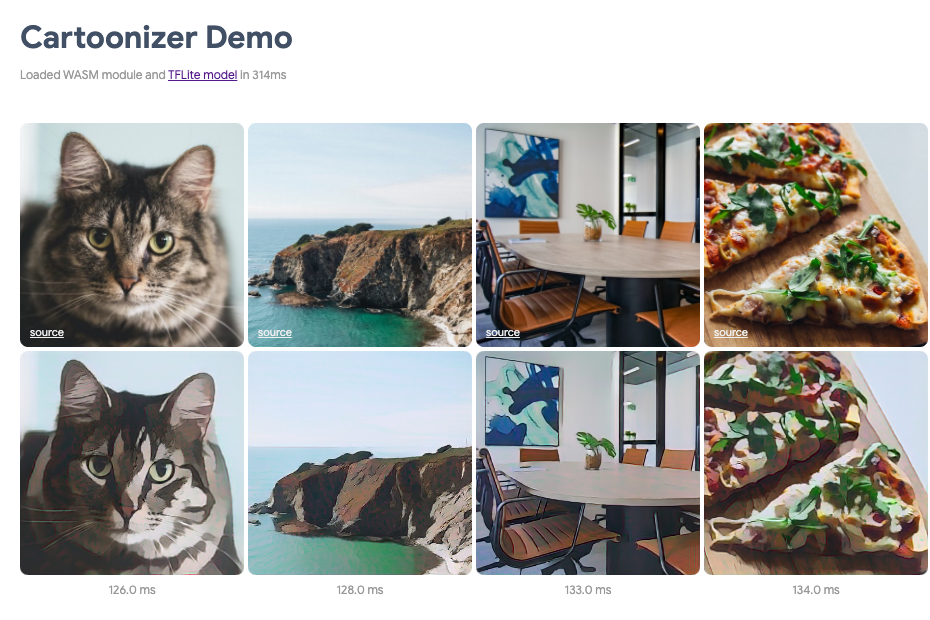

# Cartoonizer demo

This demo "cartoonizes" a set of pictures and your webcam feed by using the
`tfjs-tflite` package and the CartoonGAN model described in this
[blog post][blog].

Here is the [live demo][live demo] you can try out. For best performance, enable
the "WebAssembly SIMD support" and "WebAssembly threads support" in
`chrome://flags/`.



## Run the demo locally

cd into the `tfjs-tflite` folder:

```sh
$ cd tfjs/tfjs-tflite
```

Make sure `gsutil` is installed. It will be used by the script below.
Follow the installation instructions [here][gsutil]. You can skip the
"Setting Up Credentials to Access Protected Data" section.

Build the `tfjs-tflite` package locally.
```sh
$ yarn
# This script will download the TFLite web API WASM module files and JS client
# to deps/. This script will use `gsutil`.
$ ./scripts/download-tflite-web-api.sh
# This will bundle and copy everything needed to tfjs-tflite/dist/ which will
# be used by the local demo.
$ yarn build-npm
```

cd into the `demo` folder
```sh
$ cd demo
```

Build and run the demo locally
```sh
$ yarn
$ yarn watch
```


[blog]: https://blog.tensorflow.org/2020/09/how-to-create-cartoonizer-with-tf-lite.html
[live demo]: https://storage.googleapis.com/tfweb/demos/cartoonizer/index.html
[gsutil]: https://cloud.google.com/storage/docs/gsutil_install
